# FixplianceAI Multi-Tenant Incident Response System
## Complete Visual Guide: Uptime Kuma → Spike.sh → Team Escalation


## 📋 Complete Service Inventory

### **Services Monitored Across All Tenants**


---

## 🎯 Service Details & Health Check Endpoints

| Service | Endpoint Pattern | Check Type | Purpose |
|---------|-----------------|------------|---------|
| **Web UI** | `https://{tenant}.hub.fixpliance.ai/auditvault` | HTTP GET | Main application interface |
| **Root** | `https://{tenant}.hub.fixpliance.ai/` | HTTP GET | Base domain health |
| **Audit Vault API** | `https://{tenant}.hub.fixpliance.ai/api/auditvault/v1/health` | HTTP GET | Core audit management |
| **Consumer API** | `https://{tenant}.hub.fixpliance.ai/api/consumer/v1/health` | HTTP GET | Data consumption service |
| **Vigilant API** | `https://{tenant}.hub.fixpliance.ai/api/vigilant/v1/health` | HTTP GET | Monitoring & analysis |
| **Node Monitor API** | `https://{tenant}.hub.fixpliance.ai/api/node-monitor/v1/health` | HTTP GET | Infrastructure monitoring |
| **Scheduler API** | `https://{tenant}.hub.fixpliance.ai/api/scheduler/v1/health` | HTTP GET | Job scheduling service |
| **SonarQube** | `https://development.hub.fixpliance.ai/sonarqube` | HTTP GET | Code quality analysis |
| **Grafana** | `https://development.hub.fixpliance.ai/grafana/healthz` | HTTP GET | Metrics visualization |
| **ArgoCD** | `https://development.hub.fixpliance.ai/argocd/healthz` | HTTP GET | GitOps deployment |

**Tenant Variables:**
- `development` - Development environment
- `dev3` - Testing/staging environment  
- `{clientname}` - Production client instances (e.g., `acme`, `techcorp`, `enterprise`)

---

## 📊 End-to-End Incident Response Flow


---

## 🔍 Detailed Incident Flow with Real Endpoints


## 📊 Service Health Matrix

```mermaid
graph LR
    subgraph "Tenant: client1.hub.fixpliance.ai"
        A1[Web UI ✅ 99.8%]
        A2[Root ✅ 99.9%]
        A3[Audit Vault API ✅ 99.5%]
        A4[Consumer API ✅ 99.7%]
        A5[Vigilant API ✅ 99.6%]
        A6[Node Monitor API ✅ 99.4%]
        A7[Scheduler API ✅ 99.3%]
    end
    
    subgraph "Tenant: development"
        B1[SonarQube ✅ 98.5%]
        B2[Grafana ✅ 99.1%]
        B3[ArgoCD ✅ 98.8%]
    end
    
    subgraph "Overall Health"
        C1[Frontend: 99.85%]
        C2[Backend APIs: 99.5%]
        C3[DevOps: 98.8%]
        C4[Total: 99.4%]
    end
    
    A1 --> C1
    A2 --> C1
    
    A3 --> C2
    A4 --> C2
    A5 --> C2
    A6 --> C2
    A7 --> C2
    
    B1 --> C3
    B2 --> C3
    B3 --> C3
    
    C1 --> C4
    C2 --> C4
    C3 --> C4
    
    style C4 fill:#6bcf7f
    style A1 fill:#6bcf7f
    style A2 fill:#6bcf7f
    style A3 fill:#6bcf7f
```



---

## 🔧 Uptime Kuma Webhook Payload (Updated)

### **Custom Body for Multi-Tenant Monitoring:**

```json
{
  "title": "{{msg}}",
  "tenant": "{{monitorJSON['name']}}",
  "service_name": "{{monitorJSON['description']}}",
  "monitor_url": "{{monitorJSON['url']}}",
  "monitor_type": "{{monitorJSON['type']}}",
  "status_message": "{{heartbeatJSON['msg']}}",
  "response_time": "{{heartbeatJSON['ping']}}",
  "timestamp": "{{heartbeatJSON['time']}}",
  "status_code": "{{heartbeatJSON['status']}}",
  "tags": "{{monitorJSON['tags']}}",
  "interval": "{{monitorJSON['interval']}}",
  "environment": "production"
}
```

### **Example Monitors in Uptime Kuma:**

| Monitor Name | URL | Description | Tags |
|-------------|-----|-------------|------|
| `client1-web-ui` | `https://client1.hub.fixpliance.ai/auditvault` | Web UI | `production, frontend, client1` |
| `client1-auditvault-api` | `https://client1.hub.fixpliance.ai/api/auditvault/v1/health` | Audit Vault API | `production, api, critical, client1` |
| `client1-consumer-api` | `https://client1.hub.fixpliance.ai/api/consumer/v1/health` | Consumer API | `production, api, client1` |
| `client1-vigilant-api` | `https://client1.hub.fixpliance.ai/api/vigilant/v1/health` | Vigilant API | `production, api, client1` |
| `client1-node-monitor-api` | `https://client1.hub.fixpliance.ai/api/node-monitor/v1/health` | Node Monitor API | `production, api, client1` |
| `client1-scheduler-api` | `https://client1.hub.fixpliance.ai/api/scheduler/v1/health` | Scheduler API | `production, api, client1` |
| `client1-root` | `https://client1.hub.fixpliance.ai/` | Root Domain | `production, frontend, client1` |
| `dev-sonarqube` | `https://development.hub.fixpliance.ai/sonarqube` | SonarQube | `development, devops, sonarqube` |
| `dev-grafana` | `https://development.hub.fixpliance.ai/grafana/healthz` | Grafana | `development, devops, monitoring` |
| `dev-argocd` | `https://development.hub.fixpliance.ai/argocd/healthz` | ArgoCD | `development, devops, deployment` |

---

## 🔄 Service Recovery Flow


## 📞 Escalation Contacts

### **Primary On-Call**
- **Name:** Jyothi Ram
- **Phone:** [Configured in Spike.sh]
- **Email:** jyothi@fixpliance.ai
- **Slack:** @jyothi

### **Secondary Escalation**
- **Name:** Harish Matheshwaran
- **Email:** harish.m@fixpliance.ai
- **Slack:** @harish

### **Spike.sh Support**
- **Founder:** Kaushik Thirthappa
- **Email:** kaushik@spike.sh
- **Documentation:** https://docs.spike.sh
