# FixplianceAI Multi-Tenant Incident Response System
## Complete Visual Guide: Uptime Kuma → Spike.sh → Team Escalation

---

## 🏗️ Architecture Overview: Multi-Tenant Monitoring


---

## 📋 Complete Service Inventory

### **Services Monitored Across All Tenants**


---

## 🎯 Service Details & Health Check Endpoints

| Service | Endpoint Pattern | Check Type | Purpose |
|---------|-----------------|------------|---------|
| **Web UI** | `https://{tenant}.hub.fixpliance.ai/auditvault` | HTTP GET | Main application interface |
| **Root** | `https://{tenant}.hub.fixpliance.ai/` | HTTP GET | Base domain health |
| **Audit Vault API** | `https://{tenant}.hub.fixpliance.ai/api/auditvault/v1/health` | HTTP GET | Core audit management |
| **Consumer API** | `https://{tenant}.hub.fixpliance.ai/api/consumer/v1/health` | HTTP GET | Data consumption service |
| **Vigilant API** | `https://{tenant}.hub.fixpliance.ai/api/vigilant/v1/health` | HTTP GET | Monitoring & analysis |
| **Node Monitor API** | `https://{tenant}.hub.fixpliance.ai/api/node-monitor/v1/health` | HTTP GET | Infrastructure monitoring |
| **Scheduler API** | `https://{tenant}.hub.fixpliance.ai/api/scheduler/v1/health` | HTTP GET | Job scheduling service |
| **SonarQube** | `https://development.hub.fixpliance.ai/sonarqube` | HTTP GET | Code quality analysis |
| **Grafana** | `https://development.hub.fixpliance.ai/grafana/healthz` | HTTP GET | Metrics visualization |
| **ArgoCD** | `https://development.hub.fixpliance.ai/argocd/healthz` | HTTP GET | GitOps deployment |

**Tenant Variables:**
- `development` - Development environment
- `dev3` - Testing/staging environment  
- `{clientname}` - Production client instances (e.g., `acme`, `techcorp`, `enterprise`)

---

## 📊 End-to-End Incident Response Flow


---

## 🔍 Detailed Incident Flow with Real Endpoints


---

## 🏢 Multi-Tenant Monitoring Strategy

```mermaid
graph TB
    subgraph "Environment Types"
        A[Development<br/>development.hub.fixpliance.ai]
        B[Staging<br/>dev3.hub.fixpliance.ai]
        C[Production<br/>{client}.hub.fixpliance.ai]
    end
    
    subgraph "Monitor Configuration by Environment"
        D[Development Monitors]
        E[Check: Every 5 minutes<br/>Retries: 5<br/>Alert: Email only]
        
        F[Staging Monitors]
        G[Check: Every 2 minutes<br/>Retries: 3<br/>Alert: Slack + Email]
        
        H[Production Monitors]
        I[Check: Every 60 seconds<br/>Retries: 3<br/>Alert: ALL channels<br/>Priority: CRITICAL]
    end
    
    subgraph "Alert Routing"
        J{Environment?}
        K[Low Priority]
        L[Medium Priority]
        M[High Priority]
    end
    
    A --> D
    D --> E
    E --> J
    
    B --> F
    F --> G
    G --> J
    
    C --> H
    H --> I
    I --> J
    
    J -->|Development| K
    J -->|Staging| L
    J -->|Production| M
    
    K --> N[Email Notification]
    L --> O[Slack + Email]
    M --> P[SMS + Slack + Email + Phone]
    
    style A fill:#95e1d3
    style B fill:#ffd93d
    style C fill:#ff6b6b
    style M fill:#ff6b6b,color:#fff
```

---

## 📊 Service Health Matrix

```mermaid
graph LR
    subgraph "Tenant: client1.hub.fixpliance.ai"
        A1[Web UI ✅ 99.8%]
        A2[Root ✅ 99.9%]
        A3[Audit Vault API ✅ 99.5%]
        A4[Consumer API ✅ 99.7%]
        A5[Vigilant API ✅ 99.6%]
        A6[Node Monitor API ✅ 99.4%]
        A7[Scheduler API ✅ 99.3%]
    end
    
    subgraph "Tenant: development"
        B1[SonarQube ✅ 98.5%]
        B2[Grafana ✅ 99.1%]
        B3[ArgoCD ✅ 98.8%]
    end
    
    subgraph "Overall Health"
        C1[Frontend: 99.85%]
        C2[Backend APIs: 99.5%]
        C3[DevOps: 98.8%]
        C4[Total: 99.4%]
    end
    
    A1 --> C1
    A2 --> C1
    
    A3 --> C2
    A4 --> C2
    A5 --> C2
    A6 --> C2
    A7 --> C2
    
    B1 --> C3
    B2 --> C3
    B3 --> C3
    
    C1 --> C4
    C2 --> C4
    C3 --> C4
    
    style C4 fill:#6bcf7f
    style A1 fill:#6bcf7f
    style A2 fill:#6bcf7f
    style A3 fill:#6bcf7f
```



---

## 🔧 Uptime Kuma Webhook Payload (Updated)

### **Custom Body for Multi-Tenant Monitoring:**

```json
{
  "title": "{{msg}}",
  "tenant": "{{monitorJSON['name']}}",
  "service_name": "{{monitorJSON['description']}}",
  "monitor_url": "{{monitorJSON['url']}}",
  "monitor_type": "{{monitorJSON['type']}}",
  "status_message": "{{heartbeatJSON['msg']}}",
  "response_time": "{{heartbeatJSON['ping']}}",
  "timestamp": "{{heartbeatJSON['time']}}",
  "status_code": "{{heartbeatJSON['status']}}",
  "tags": "{{monitorJSON['tags']}}",
  "interval": "{{monitorJSON['interval']}}",
  "environment": "production"
}
```

### **Example Monitors in Uptime Kuma:**

| Monitor Name | URL | Description | Tags |
|-------------|-----|-------------|------|
| `client1-web-ui` | `https://client1.hub.fixpliance.ai/auditvault` | Web UI | `production, frontend, client1` |
| `client1-auditvault-api` | `https://client1.hub.fixpliance.ai/api/auditvault/v1/health` | Audit Vault API | `production, api, critical, client1` |
| `client1-consumer-api` | `https://client1.hub.fixpliance.ai/api/consumer/v1/health` | Consumer API | `production, api, client1` |
| `client1-vigilant-api` | `https://client1.hub.fixpliance.ai/api/vigilant/v1/health` | Vigilant API | `production, api, client1` |
| `client1-node-monitor-api` | `https://client1.hub.fixpliance.ai/api/node-monitor/v1/health` | Node Monitor API | `production, api, client1` |
| `client1-scheduler-api` | `https://client1.hub.fixpliance.ai/api/scheduler/v1/health` | Scheduler API | `production, api, client1` |
| `client1-root` | `https://client1.hub.fixpliance.ai/` | Root Domain | `production, frontend, client1` |
| `dev-sonarqube` | `https://development.hub.fixpliance.ai/sonarqube` | SonarQube | `development, devops, sonarqube` |
| `dev-grafana` | `https://development.hub.fixpliance.ai/grafana/healthz` | Grafana | `development, devops, monitoring` |
| `dev-argocd` | `https://development.hub.fixpliance.ai/argocd/healthz` | ArgoCD | `development, devops, deployment` |

---

## 🎯 Spike.sh Title Remapper Configuration

### **Rule 1: Production Client Services (Critical)**

```yaml
Service: FixplianceAI Production
Condition: tags contains "production" AND "critical"
Title Format: 🚨 [{{tenant}}] {{service_name}} - {{status_message}} ({{response_time}}ms)
Description Format: |
  **CRITICAL PRODUCTION ALERT**
  
  **Client:** {{tenant}}
  **Service:** {{service_name}}
  **URL:** {{monitor_url}}
  **Status:** {{status_message}}
  **Response Time:** {{response_time}}ms
  **Timestamp:** {{timestamp}}
  **Environment:** {{environment}}
  
  ⚠️ IMMEDIATE ACTION REQUIRED
Priority: P1
Severity: Critical
```

**Example Output:**
```
Title: 🚨 [client1] Audit Vault API - Connection timeout (0ms)

Description:
**CRITICAL PRODUCTION ALERT**

**Client:** client1
**Service:** Audit Vault API
**URL:** https://client1.hub.fixpliance.ai/api/auditvault/v1/health
**Status:** Connection timeout
**Response Time:** 0ms
**Timestamp:** 2025-12-30 10:30:00
**Environment:** production

⚠️ IMMEDIATE ACTION REQUIRED
```

### **Rule 2: Development/DevOps Tools (Standard)**

```yaml
Service: FixplianceAI Development
Condition: tags contains "development" OR "devops"
Title Format: ℹ️ [DEV] {{service_name}} - {{status_message}}
Description Format: |
  **Development Environment Alert**
  
  **Service:** {{service_name}}
  **URL:** {{monitor_url}}
  **Status:** {{status_message}}
  **Response Time:** {{response_time}}ms
  **Timestamp:** {{timestamp}}
  
  Non-critical - investigate when available
Priority: P3
Severity: Info
```

---

## 📈 Monitoring Scale & Coverage


### **Current Scale:**

- **Tenants Monitored:** 5 (development, dev3, + 3 production clients)
- **Services per Tenant:** 7-10 endpoints
- **Total Monitors:** ~53 active monitors
- **Check Frequency:** 60 seconds for production, 5 minutes for dev
- **Monthly Checks:** ~2.6 million health checks
- **Alert Volume:** ~15-20 incidents per month
- **MTTR:** 14 minutes 40 seconds average

---

## 🚨 Alert Examples by Service Type

### **1. Frontend Service Down**

```
SMS: 🚨 [client1] Web UI DOWN - Connection refused

Slack:
🔴 @channel CRITICAL ALERT

**Client:** client1
**Service:** Web UI
**URL:** https://client1.hub.fixpliance.ai/auditvault
**Status:** Connection refused
**Impact:** Users cannot access application
**Time:** 10:30:00

Action Required: Investigate immediately
```

### **2. API Service Degraded**

```
SMS: ⚠️ [client1] Consumer API SLOW - 5000ms response

Slack:
🟡 WARNING

**Client:** client1
**Service:** Consumer API
**URL:** https://client1.hub.fixpliance.ai/api/consumer/v1/health
**Status:** 200 OK (Slow response)
**Response Time:** 5000ms (Normal: 50ms)
**Time:** 10:30:00

Action: Monitor for escalation
```

### **3. DevOps Tool Down**

```
Email Only:
Subject: ℹ️ [DEV] SonarQube - Connection timeout

Service: SonarQube
URL: https://development.hub.fixpliance.ai/sonarqube
Status: Connection timeout
Environment: Development
Priority: Low
Time: 10:30:00

This is a non-critical development service. Investigate when available.
```

---

## 🔄 Service Recovery Flow


---

## 📊 Key Performance Indicators (KPIs)

### **Response Time Metrics**


### **Success Metrics**

| Metric | Target | Actual | Status |
|--------|--------|--------|--------|
| **Uptime** | 99.5% | 99.7% | ✅ Exceeds |
| **MTTA** (Mean Time to Acknowledge) | < 5 min | 3m 8s | ✅ Exceeds |
| **MTTI** (Mean Time to Investigate) | < 15 min | 3m 33s | ✅ Exceeds |
| **MTTR** (Mean Time to Resolve) | < 30 min | 14m 40s | ✅ Exceeds |
| **False Positive Rate** | < 5% | 2.3% | ✅ Exceeds |
| **Alert Delivery Success** | > 99% | 99.9% | ✅ Exceeds |

---

## 🛠️ Troubleshooting Guide

### **Common Scenarios**

```mermaid
flowchart TD
    Start[Issue Detected] --> Type{Issue Type?}
    
    Type -->|No Alerts| NoAlert[No Alert Received]
    Type -->|Wrong Alert| WrongAlert[Incorrect Alert Data]
    Type -->|Too Many| TooMany[Alert Fatigue]
    Type -->|Delayed| Delayed[Delayed Alerts]
    
    NoAlert --> Check1{Webhook<br/>Configured?}
    Check1 -->|No| Fix1[Configure Spike.sh<br/>in Uptime Kuma]
    Check1 -->|Yes| Check2{Applied to<br/>Monitor?}
    Check2 -->|No| Fix2[Apply Notification<br/>to Monitors]
    Check2 -->|Yes| Check3{Test<br/>Works?}
    Check3 -->|No| Fix3[Verify Webhook URL<br/>Check Network]
    
    WrongAlert --> Check4{Title Remapper<br/>Configured?}
    Check4 -->|No| Fix4[Configure Title Remapper<br/>in Spike.sh]
    Check4 -->|Yes| Fix5[Update Webhook Payload<br/>Add Missing Fields]
    
    TooMany --> Check5{False<br/>Positives?}
    Check5 -->|Yes| Fix6[Increase Retries to 5<br/>Increase Timeout to 60s]
    Check5 -->|No| Fix7[Enable Incident Grouping<br/>Adjust Check Intervals]
    
    Delayed --> Check6{Network<br/>Issue?}
    Check6 -->|Yes| Fix8[Check Firewall Rules<br/>Verify DNS Resolution]
    Check6 -->|No| Fix9[Check Spike.sh Status<br/>Contact Support]
    
    Fix1 --> Resolved[✅ Issue Resolved]
    Fix2 --> Resolved
    Fix3 --> Resolved
    Fix4 --> Resolved
    Fix5 --> Resolved
    Fix6 --> Resolved
    Fix7 --> Resolved
    Fix8 --> Resolved
    Fix9 --> Resolved
    
    style Start fill:#ff6b6b,color:#fff
    style Resolved fill:#6bcf7f
```



---

## 🎯 Best Practices for Multi-Tenant Monitoring

### **1. Monitor Naming Convention**

```
Format: {tenant}-{service}-{type}

Examples:
- client1-auditvault-api
- client1-web-ui
- dev3-consumer-api
- development-sonarqube
```

### **2. Tagging Strategy**

```yaml
Required Tags:
  - environment: [production, staging, development]
  - tenant: [client1, client2, dev3, development]
  - service_type: [frontend, api, devops]
  - priority: [critical, high, medium, low]

Example:
  tags: ["production", "client1", "api", "critical"]
```

### **3. Alert Routing Rules**

```yaml
Production + Critical:
  - SMS (immediate)
  - Slack (1 min)
  - Email (2 min)
  - Phone (3 min)

Production + Standard:
  - Slack (immediate)
  - Email (2 min)
  - SMS (5 min)

Development:
  - Email (immediate)
  - Slack (5 min)
```

### **4. Health Check Intervals**

| Environment | Critical Services | Standard Services | DevOps Tools |
|------------|------------------|-------------------|--------------|
| **Production** | 60 seconds | 2 minutes | 5 minutes |
| **Staging** | 2 minutes | 5 minutes | 10 minutes |
| **Development** | 5 minutes | 10 minutes | 15 minutes |

---

## 📞 Escalation Contacts

### **Primary On-Call**
- **Name:** Jyothi Ram
- **Phone:** [Configured in Spike.sh]
- **Email:** jyothi@fixpliance.ai
- **Slack:** @jyothi

### **Secondary Escalation**
- **Name:** Harish Matheshwaran
- **Email:** harish.m@fixpliance.ai
- **Slack:** @harish

### **Spike.sh Support**
- **Founder:** Kaushik Thirthappa
- **Email:** kaushik@spike.sh
- **Documentation:** https://docs.spike.sh

---

## 🚀 Scaling Strategy

### **Current State (Q4 2024)**
```
Tenants: 5
Services: 10 per tenant
Total Monitors: 53
Monthly Cost: ~$100
```

### **Projected Growth (Q1 2025)**
```
Tenants: 15
Services: 10 per tenant
Total Monitors: 153
Monthly Cost: ~$140
Team Size: 5 engineers
```

### **Future State (Q4 2025)**
```
Tenants: 50+
Services: 10 per tenant
Total Monitors: 500+
Monthly Cost: ~$300
Team Size: 15 engineers
Features: Multi-team on-call, war rooms, JIRA integration
```

---

## 📈 ROI Analysis

### **Cost Comparison (Annual)**

| Solution | Setup | Annual Cost | Total (3 Years) |
|----------|-------|-------------|-----------------|
| **Current: Uptime Kuma + Spike.sh** | $100 | $1,200 | $3,700 |
| **Alternative: PagerDuty + Pingdom** | $500 | $25,000 | $75,500 |
| **Alternative: Datadog + OpsGenie** | $1,000 | $30,000 | $91,000 |

**Savings: $71,800+ over 3 years (95% cost reduction)**

---

## ✅ Summary

### **What We Monitor**
- ✅ 7 Backend APIs per tenant
- ✅ 2 Frontend services per tenant
- ✅ 3 DevOps tools (development only)
- ✅ Root domains for each tenant
- ✅ Total: ~53 active monitors

### **How We Alert**
- ✅ 4-step escalation (SMS → Slack → Email → Phone)
- ✅ 1-minute escalation intervals
- ✅ Auto-resolve on recovery
- ✅ Customized by environment and priority

### **Performance**
- ✅ 99.7% uptime maintained
- ✅ 3-minute average acknowledgment
- ✅ 15-minute average resolution
- ✅ 2.3% false positive rate

### **Cost Efficiency**
- ✅ $100/month total cost
- ✅ 95% cheaper than alternatives
- ✅ Unlimited alerts and monitors
- ✅ Scalable to 500+ monitors

---

**Last Updated:** December 30, 2025  
**Version:** 2.0  
**Status:** Production ✅  
**Coverage:** 5 tenants, 53 monitors, 10 services per tenant
